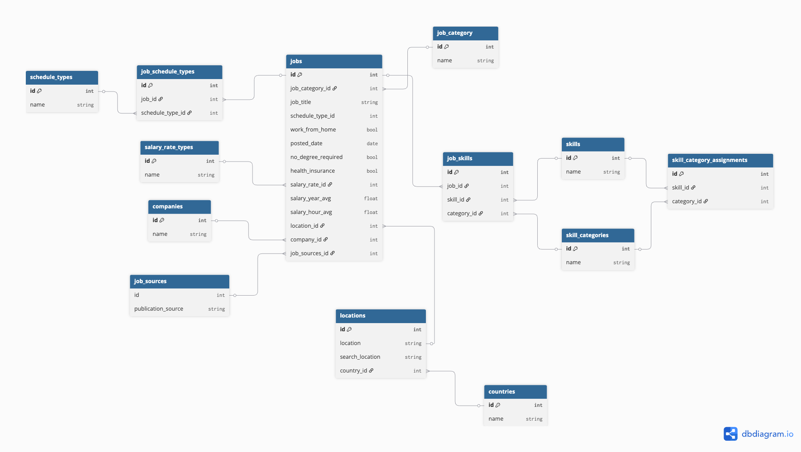
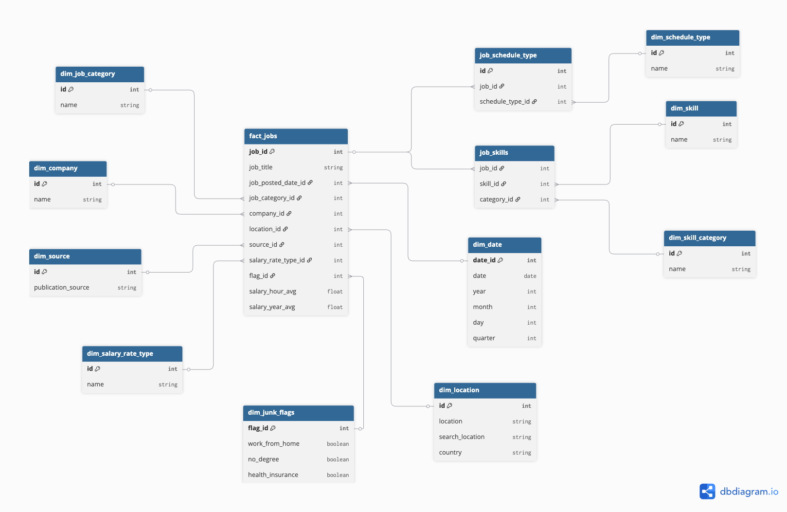

## DATA ENGINEER TEST

### DESIGN DECISIONS

1. Normalized Data Model (3NF):
    The job listing data was transformed into a relational model in 
    Third Normal Form to eliminate redundancy and improve data integrity. 
    Key decisions include:

    * Dimensional modeling: Entities like companies, countries, skills, categories, salary rates 
    and locations were extracted into separate dimension tables to ensure reusability 
    and consistency.

    * Many-to-many relationships: Implemented via bridge tables such as job_skills 
    and category_assignments, enabling jobs to be linked to multiple skills 
    and categories without duplication.

    * Normalization of semi-structured data: Fields like job_skills and 
    job_type_skills were parsed using PostgreSQL’s JSON functions and unnesting 
    logic to fit the relational structure.

    

2. Tooling Choices:
    * DBT: DBT was selected as a tool to transform the data due to the ease of implementing the logic of the models, tracking the new structure and applying the tests. On the other hand, it is a tool that I am working with in my day and I wanted to try it in this project.

    * Docker + PostgreSQL: Working with Docker was selected due to the popularity of the tool and the fact that it is very easy to deploy. And in the same way, PostgreSQL was chosen as a relational database to store raw and transformed data because I have a lot of experience working with this tool, and it also has very good compatibility with DBT.

    * Python + Pandas: Working with Python + Pandas was selected because Pandas is a highly recommended tool for data manipulation, both for reading and for subsequent analysis, therefore, it was very useful when doing a small exploration of the data before loading it into PostgreSQL.

### EXECUTION INSTRUCTIONS

1. Clone the repository:
    ```bash
    git clone https://github.com/CamiloLoaizaR/data-engineer-test
    cd data-engineer-test
    ```
2. Set up environment variables:
    Copy *``.env``* file into the project folder

3. Export the environment variables:
    ```bash
    export $(cat .env | xargs)
    ```
4. Start the PostgreSQL database:
    ```bash
    docker-compose up -d
    ```
5. Install dependencies and activate virtual environment:
    ```bash
    uv venv
    source .venv/bin/activate
    uv pip install -r requirements.txt
    ```
6. Copy *``data_jobs.csv``* file into project folder

7. Load the raw data (CSV) into PostgreSQL:
    ```bash
    python ingest_jobs.py
    ```
8. Run DBT transformations:
    ```bash
    cd dbt_jobs_project
    dbt deps
    dbt seed --profiles-dir .dbt
    dbt run --profiles-dir .dbt
    ```
9. View the models:
    ```bash
    dbt docs generate --profiles-dir .dbt
    dbt docs serve
    ```

### TESTING GUIDE

* Run all DBT test:
    ```bash
    dbt test --profiles-dir .dbt
    ```

* Run only tests for a specific model:
    ```bash
    dbt test --select [model] --profiles-dir .dbt
    ```

DBT shows output per test. Failed tests produce .sql files in target/compiled/ that can be reviewed and re-executed manually to debug.

### STAR SCHEMA PROPOSAL



* Fact table: The central table in the Star Schema is *fact_jobs* that records each job posting as a fact. The granularity is one row per job posting, this means the most atomic level is each unique job listing.

* Dimensions:

    1. dim_company:
        * Contains information about the companies posting jobs.
        * Columns: company_id, company_name
    2. dim_date:
        * Date dimension used to analyze events over time.
        * Columns: date_id, date, year, month, day, quarter
    3. dim_location:
        * Represents geographic data of the job.
        * Columns: location_id, location, search_location, country
    4. dim_salary_rate_type:
        * Contains unique values of salary rate.
        * Columns: salary_rate_id, name
    5. dim_job_category:
        * Based on normalized job_title_short.
        * Columns: category_id, name
    6. dim_source:
        * Contains info where the job was posted.
        * Columns: source_id, publication_source
    7. dim_schedule_type:
        * Captures schedule categories
        * Columns: schedule_type_id, name
    8. dim_junk_flags:
        * A "junk dimension" that holds multiple boolean flags.
        * Columns: flag_id, no_degree, health_insurance, work_from_home
    9. dim_skill:
        * Contains list of job skills
        * Columns: job_id, name 
    10. dim_skill_category:
        * Contains list of job skills categories
        * Columns: category_id, name

* Numerical metrics: The most useful quantitative fields stored in fact_jobs:
    * salary_year_avg: Average annual salary
    * salary_hour_avg: Average hourly salary
    * posted_date

* Design challenges: 
    * To manage job skills data, a bridge table is used to connect fact_jobs, dim_skills and dim_skill_category
    * To manage the boolean data, a "junk dimension" is used instead of keeping them in the fact table.
